# Avaliação — Engenharia de Software
**Sistema Integrado de Gestão de Farmácia — MVP Definido pelo Estudante**

Aluno: **Leonardo Delfino Vieira** 
RA: **25000296**  
Data: **25/03/2026**

---

# 1. Definição do MVP
Descreva aqui **qual parte do sistema** foi incluída no seu MVP.  

- O que está **dentro** do MVP  
   - Gestão de Estoque e Produtos
   - Compra e Fornecedorers
- O que está **fora** do MVP  
   - Operação da Farmácia e Atendimento ao Cliente
   - Contas a Pagar e Contas a Receber
   - Relatórios e Indicadores
   - Perfis de Usuários e Permissões
   - Integração de Processos
   - Objetivo do Sistema

- Por que você fez essas escolhas  
Escolhi esses MVPs pois foram os que mais me agradaram e os que eu mais tenho conhecimento devido ao meu trabalho atual, onde constantemente estou em contato com estoque de produtos, vejo diariamente produtos entrando e saindo dele e sendo entregue a clientes.

---

# 2. Regras de Negócio  

**RN01 —** Produtos sem estoque não podem ser comercializados.
O sistema deve bloquear automaticamente a venda de qualquer item com quantidade disponível igual a zero.  
**RN02 —** Cada farmácia possui estoque próprio e independente. 
Movimentações em uma unidade não afetam diretamente o estoque de outra, exceto por transferências explícitas.  
**RN03 —** Toda compra realizada junto a fornecedores deve gerar automaticamente um lançamento em contas a pagar, com data de vencimento e status inicial "Aberta".  
**RN04 —** O estoque deve ser atualizado automaticamente após qualquer movimentação: venda, devolução, perda, transferência ou reposição. Atualizações manuais não são permitidas para esses eventos.   
**RN05 —**  O sistema deve emitir alertas quando a quantidade de um produto atingir ou ficar abaixo do nível mínimo cadastrado, sinalizando a necessidade de reposição.  

---

# 3. Requisitos Funcionais  

**RF01 —** O sistema deve atualizar o estoque da unidade automaticamente ao registrar uma venda, deduzindo a quantidade vendida do produto correspondente.  
**RF02 —** O sistema deve registrar devoluções e estornar a quantidade ao estoque da unidade que realizou a venda original.  
**RF03 —** O sistema deve permitir o registro de perdas de produtos, subtraindo a quantidade do estoque e armazenando o motivo da perda.  
**RF04 —** O sistema deve permitir transferências de produtos entre unidades, atualizando o estoque de origem (saída) e de destino (entrada) de forma simultânea.  
**RF05 —** O sistema deve registrar entradas de estoque vinculadas a pedidos de compra, atualizando automaticamente a quantidade disponível após confirmação do recebimento.  
**RF06 —** O sistema deve registrar pedidos de compra contendo: produto, quantidade, data, valor total, fornecedor e unidade receptora.  
**RF07 —** Ao confirmar uma compra, o sistema deve gerar automaticamente um registro em contas a pagar com valor, data de vencimento e status "Aberta", além de suportar as transições para "Paga" e "Atrasada".  
**RF08 —** Gerentes devem poder cadastrar novos produtos e editar informações de produtos existentes, como nome, descrição, nível mínimo de estoque e dados do fornecedor.  

---

# 🛡 4. Requisitos Não Funcionais  

**RNF01 —** Desempenho: as atualizações de estoque decorrentes de movimentações devem ser processadas em tempo real, com latência máxima de 2 segundos após o registro do evento.  
**RNF02 —** Confiabilidade: o sistema deve garantir consistência dos dados de estoque mesmo em cenários de falha parcial, utilizando transações atômicas para operações que envolvam múltiplas tabelas (ex.: compra + contas a pagar).  
**RNF03 —** Segurança e controle de acesso: apenas usuários com perfil de gerente devem ter permissão para cadastrar ou editar produtos. Operações de venda e movimentação devem estar restritas a operadores autorizados de cada unidade.  
**RNF04 —** Auditabilidade: todas as movimentações de estoque e registros financeiros devem manter histórico imutável com data, hora, usuário responsável e tipo de operação, possibilitando rastreabilidade completa.  

---

# 5. Casos de Uso 

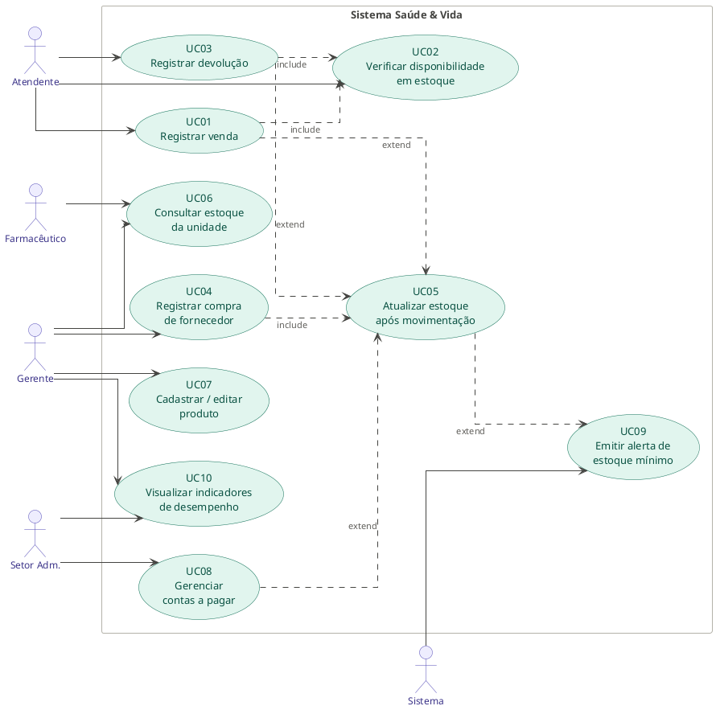

**UC01** – Registrar venda (Atendente) — inclui UC02 e pode estender para UC10 se houver alerta de estoque.  
**UC02** – Verificar disponibilidade em estoque (include de UC01 e UC06).  
**UC03** – Registrar devolução (Atendente) — estende UC01 quando o cliente devolve um produto.  
**UC04** – Registrar compra de fornecedor (Gerente) — inclui UC05.  
**UC05** – Atualizar estoque após movimentação (include de UC01, UC03, UC04).  
**UC06** – Consultar estoque da unidade (Gerente / Farmacêutico).  
**UC07** – Cadastrar/editar produto (Gerente).  
**UC08** – Gerenciar contas a pagar (Setor Administrativo) — inclui UC04 como gatilho, estende para registrar pagamento.  
**UC09** – Emitir alertas de estoque mínimo (Sistema) — estende UC05 quando quantidade cai abaixo do limite.  
**UC10** – Visualizar indicadores de desempenho (Gerente / Setor Administrativo).  

**Relações include:**  

**UC01 inclui UC02:** toda venda obrigatoriamente verifica o estoque disponível antes de ser concluída.  
**UC03 inclui UC02:** toda devolução também verifica o estoque antes de atualizar a quantidade.  
**UC04 inclui UC05:** ao registrar uma compra, o estoque é automaticamente atualizado.  

**Relações extend:**  

**UC01 estende UC05:** a venda aciona a atualização de estoque (decremento) ao ser finalizada.  
**UC03 estende UC05:** a devolução aciona a atualização de estoque (incremento) ao ser registrada.  
**UC08 estende UC05:** quando a atualização de estoque ocorre por uma compra, ela dispara o lançamento em contas a pagar.  
**UC05 estende UC09:** quando a quantidade atinge o nível mínimo após qualquer movimentação, o alerta é emitido.  

**Atores e seus casos de uso:**  

**Atendente:** UC01, UC02, UC03  
**Farmacêutico:** UC06  
**Gerente:** UC04, UC07, UC09, UC10  
**Setor Administrativo:** UC08, UC10  
**Sistema (ator secundário):** UC09 (disparo automático)  

---

# 6. Documentação dos Casos de Uso

**UC01 — Registrar Venda**  
*Ator:* Atendente  
*Descrição:* Permite ao atendente registrar uma venda de produtos a um cliente, verificando disponibilidade em estoque e finalizando a transação com atualização automática do estoque.  
*Pré-condições:*  
•	Atendente autenticado no sistema.  
•	Produto(s) deve(m) estar cadastrado(s) e com estoque disponível.  
*Pós-condições:*  
•	Venda registrada com data, itens, quantidades e valor total.  
•	Estoque da unidade atualizado (decrementado).  
•	Registro financeiro gerado em contas a receber (quando aplicável).  
*Fluxo Principal*  
1.	Atendente inicia um novo atendimento no sistema.  
2.	Sistema solicita identificação do cliente (opcional) e dos produtos.  
3.	Atendente informa o(s) produto(s) e a(s) quantidade(s) desejada(s).  
4.	Sistema executa UC02 — Verificar disponibilidade em estoque para cada item.  
5.	Sistema exibe o resumo da venda com valor total.  
6.	Atendente confirma a venda e registra a forma de pagamento.  
7.	Sistema finaliza a venda, executa UC05 — Atualizar estoque e emite comprovante.  
*Fluxos Alternativos / Exceções*  
•	FA01 — Produto sem estoque: se UC02 identificar quantidade zero, o sistema bloqueia o item e exibe mensagem de indisponibilidade. O atendente pode remover o item ou cancelar a venda.  
•	FA02 — Cancelamento durante registro: o atendente pode cancelar a venda antes da confirmação; o sistema descarta o registro sem alterar o estoque.  
•	FA03 — Produto não encontrado: sistema exibe mensagem de erro e permite nova busca.  
*Relacionamentos*  
*Include:*   
•	UC02 — Verificar disponibilidade em estoque  
•	UC05 — Atualizar estoque após movimentação (via extend)  
*Extend:* Nenhum.  

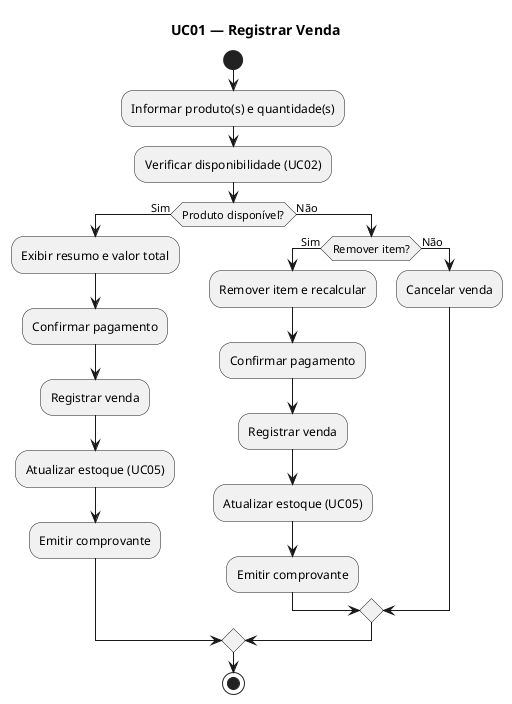

-------------------------------------

**UC02 — Verificar Disponibilidade em Estoque**  
*Atores:* Atendente, Farmacêutico (indireto via UC01 e UC03)  
*Descrição:* Consulta a quantidade disponível de um produto no estoque da unidade antes de permitir a conclusão de uma venda ou devolução.  
*Pré-condições:*  
•	Produto informado deve estar cadastrado no sistema.  
•	Estoque da unidade deve estar acessível.  
*Pós-condições:*  
•	Disponibilidade do produto confirmada ou negada.  
•	Em caso de quantidade abaixo do mínimo, alerta pode ser disparado via UC09.  
*Fluxo Principal*  
8.	Sistema recebe o código ou nome do produto a ser verificado.  
9.	Sistema consulta o estoque da unidade para o produto informado.  
10.	Sistema retorna a quantidade disponível.  
11.	Se a quantidade for zero, sistema sinaliza produto indisponível.  
12.	Se a quantidade estiver abaixo do nível mínimo, sistema aciona UC09 — Emitir alerta de estoque mínimo.  
13.	Resultado é retornado ao caso de uso chamador (UC01 ou UC03).  
*Fluxos Alternativos / Exceções*  
•	FA01 — Produto não cadastrado: sistema retorna erro e interrompe a operação chamadora.  
•	FA02 — Falha de conexão: sistema exibe mensagem de indisponibilidade temporária e impede a venda.  
*Relacionamentos*  
*Include:* Nenhum.  
*Extend:*   
•	UC09 — Emitir alerta de estoque mínimo (quando quantidade abaixo do mínimo)  

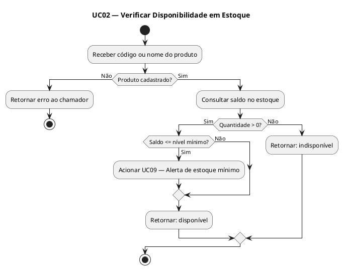

-------------------------------------

**UC03 — Registrar Devolução**  
*Ator:* Atendente  
*Descrição:* Permite ao atendente registrar a devolução de produtos por parte de um cliente, revertendo o estoque e gerando os registros financeiros correspondentes.  
*Pré-condições:*  
•	Atendente autenticado no sistema.  
•	Venda original deve estar registrada no sistema.  
•	Produto a devolver deve ser identificável.  
*Pós-condições:*  
•	Devolução registrada com data, itens e motivo.  
•	Estoque da unidade atualizado (incrementado).  
•	Crédito ou reembolso gerado no financeiro, conforme política da rede.  
*Fluxo Principal*  
14.	Atendente acessa a funcionalidade de devolução.  
15.	Atendente informa o número da venda original ou identifica o produto a devolver.  
16.	Sistema localiza a venda e exibe os itens elegíveis para devolução.  
17.	Sistema executa UC02 — Verificar disponibilidade em estoque para confirmar que o item pode ser reintegrado.  
18.	Atendente seleciona o(s) item(ns) a devolver e informa o motivo.  
19.	Sistema confirma a devolução e executa UC05 — Atualizar estoque (incremento).  
20.	Sistema gera o registro financeiro de crédito ou reembolso.  
*Fluxos Alternativos / Exceções*  
•	FA01 — Venda não encontrada: sistema exibe mensagem de erro; atendente pode realizar nova busca ou cancelar.  
•	FA02 — Prazo de devolução expirado: sistema alerta que a devolução está fora do prazo e solicita autorização do gerente.  
•	FA03 — Produto com dano: atendente registra observação de dano; sistema encaminha para análise antes de reintegrar ao estoque.  
*Relacionamentos*  
*Include:*   
•	UC02 — Verificar disponibilidade em estoque  
*Extend:*   
•	UC05 — Atualizar estoque após movimentação  

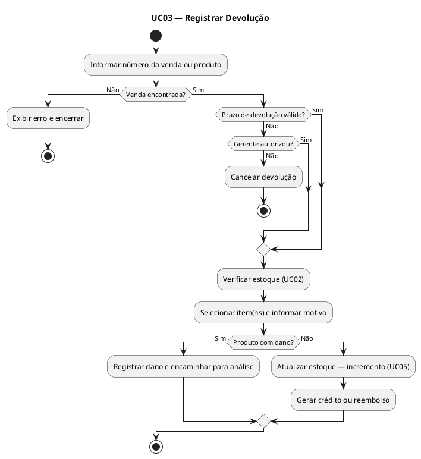

-------------------------------------

**UC04 — Registrar Compra de Fornecedor**  
*Ator:* Gerente  
*Descrição:* Permite ao gerente registrar um pedido de compra junto a um fornecedor, informando os produtos, quantidades, valores e datas, gerando automaticamente a entrada no estoque e o lançamento financeiro.  
*Pré-condições:*  
•	Gerente autenticado no sistema.  
•	Fornecedor deve estar cadastrado.  
•	Produto(s) deve(m) estar cadastrado(s) no sistema.  
*Pós-condições:*  
•	Compra registrada com todos os dados obrigatórios.  
•	Estoque da unidade atualizado via UC05.  
•	Lançamento em contas a pagar gerado com status 'Aberta'.  
*Fluxo Principal*  
21.	Gerente acessa o módulo de compras e inicia um novo pedido.  
22.	Sistema solicita os dados da compra: fornecedor, produto, quantidade, data e valor total.  
23.	Gerente preenche todos os campos obrigatórios e confirma.  
24.	Sistema valida os dados e registra a compra.  
25.	Sistema executa UC05 — Atualizar estoque (incremento conforme quantidade comprada).  
26.	Sistema gera automaticamente lançamento em UC08 — Gerenciar contas a pagar com status 'Aberta' e data de vencimento.  
27.	Sistema confirma o registro e exibe resumo da operação.  
*Fluxos Alternativos / Exceções*  
•	FA01 — Fornecedor não cadastrado: sistema bloqueia o registro e orienta o gerente a cadastrá-lo antes de continuar.  
•	FA02 — Dados incompletos: sistema destaca os campos obrigatórios não preenchidos e impede o salvamento.  
•	FA03 — Produto não cadastrado: sistema orienta o gerente a executar   UC07 antes de prosseguir.  
*Relacionamentos*  
*Include:*   
•	UC05 — Atualizar estoque após movimentação  
*Extend:*   
•	UC08 — Gerenciar contas a pagar (lançamento automático após registro da compra)  

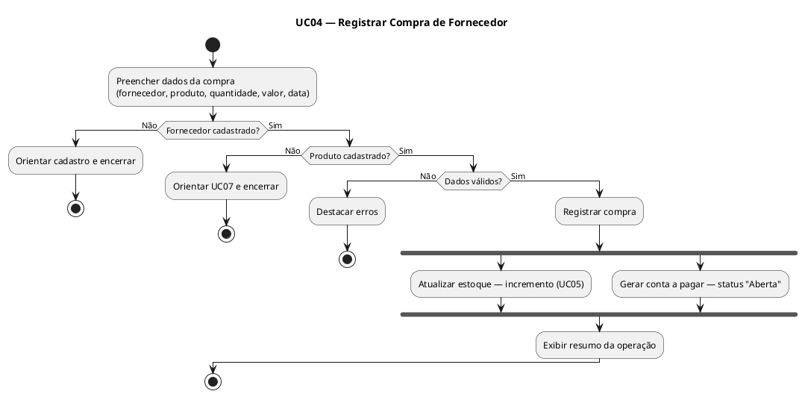

-------------------------------------

**UC05 — Atualizar Estoque Após Movimentação**  
*Ator:* Sistema (acionado automaticamente por UC01, UC03 e UC04)  
*Descrição:* Responsável por atualizar automaticamente o saldo de estoque da unidade após qualquer movimentação registrada: venda, devolução, compra, perda ou transferência.  
*Pré-condições:*  
•	Evento de movimentação devidamente registrado (venda, devolução ou compra confirmada).  
•	Produto e unidade identificados.  
*Pós-condições:*  
•	Saldo do produto atualizado no estoque da unidade.  
•	Histórico de movimentação registrado com data, tipo e responsável.  
•	UC09 acionado se saldo atingir o nível mínimo.  
*Fluxo Principal*  
28.	Sistema recebe o evento de movimentação (tipo, produto, quantidade e unidade).  
29.	Sistema identifica se a movimentação é de entrada (compra, devolução) ou saída (venda, perda, transferência).  
30.	Sistema calcula o novo saldo: saldo atual ± quantidade movimentada.  
31.	Sistema persiste o novo saldo no estoque da unidade.  
32.	Sistema registra o histórico da movimentação.  
33.	Sistema verifica se o novo saldo está abaixo do nível mínimo; se sim, aciona UC09.  
*Fluxos Alternativos / Exceções*  
•	FA01 — Saldo resultante negativo: sistema bloqueia a operação e retorna erro ao caso de uso chamador (impede venda sem estoque).  
•	FA02 — Falha de persistência: sistema registra o erro e notifica o administrador; operação é desfeita para manter consistência.  
*Relacionamentos*  
*Include:* Nenhum.  
*Extend:*  
•	UC09 — Emitir alerta de estoque mínimo (quando saldo atingir ou ficar abaixo do mínimo)  

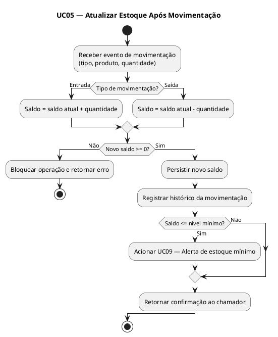

-------------------------------------

**UC06 — Consultar Estoque da Unidade**  
*Atores:* Gerente, Farmacêutico  
*Descrição:* Permite a gerentes e farmacêuticos consultar o saldo atual de produtos no estoque da unidade, com filtros por produto, categoria ou situação (normal, abaixo do mínimo, zerado).  
*Pré-condições:*  
•	Usuário autenticado com perfil de Gerente ou Farmacêutico.  
•	Estoque da unidade atualizado e acessível.  
*Pós-condições:*  
•	Lista de produtos exibida com saldos atuais.  
•	Produtos abaixo do nível mínimo destacados visualmente.  
*Fluxo Principal*  
34.	Usuário acessa o módulo de estoque.  
35.	Sistema exibe o estoque completo da unidade com saldo atual de cada produto.  
36.	Usuário pode filtrar por nome, categoria, ou situação do estoque.  
37.	Sistema aplica os filtros e exibe os resultados.  
38.	Usuário visualiza o saldo, nível mínimo e status de cada produto.
39.	Usuário pode exportar o relatório ou navegar para detalhes de um produto.  
*Fluxos Alternativos / Exceções*  
•	FA01 — Nenhum produto encontrado com os filtros aplicados: sistema exibe mensagem informativa e sugere ampliar os critérios de busca.  
•	FA02 — Estoque vazio: sistema informa que não há produtos cadastrados e orienta para UC07.  
*Relacionamentos*  
*Include:* Nenhum.  
*Extend:* Nenhum.  

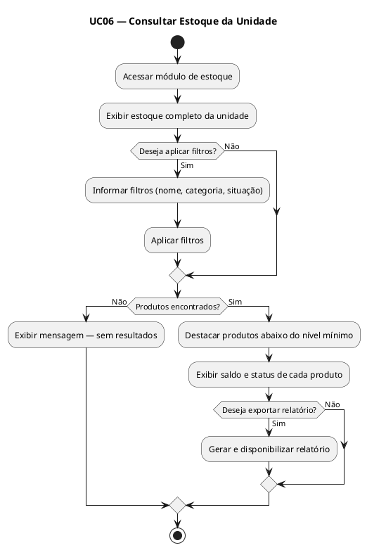

-------------------------------------

**UC07 — Cadastrar / Editar Produto**  
*Ator:* Gerente  
*Descrição:* Permite ao gerente cadastrar novos produtos no sistema ou atualizar informações de produtos existentes, incluindo nome, descrição, categoria, nível mínimo de estoque e fornecedor associado.  
*Pré-condições:*  
•	Gerente autenticado no sistema.  
•	Para edição: produto deve estar previamente cadastrado.  
*Pós-condições:*  
•	Produto criado ou atualizado com todas as informações fornecidas.  
•	Nível mínimo de estoque definido, habilitando os alertas automáticos do UC09.  
*Fluxo Principal*  
40.	Gerente acessa o cadastro de produtos.  
41.	Para novo produto: gerente seleciona 'Novo produto' e preenche os campos obrigatórios (nome, categoria, nível mínimo, fornecedor).  
42.	Para edição: gerente busca o produto existente e seleciona 'Editar'.  
43.	Gerente atualiza os campos desejados.  
44.	Sistema valida os dados informados.  
45.	Gerente confirma o cadastro ou a edição.  
46.	Sistema salva as informações e confirma a operação.  
*Fluxos Alternativos / Exceções*  
•	FA01 — Produto duplicado: sistema identifica nome ou código já cadastrado e alerta o gerente antes de salvar.  
•	FA02 — Campos obrigatórios vazios: sistema destaca os campos e impede o salvamento.  
•	FA03 — Nível mínimo inválido (valor negativo ou não numérico): sistema exibe erro de validação.  
*Relacionamentos*  
*Include:* Nenhum.  
*Extend:* Nenhum.  

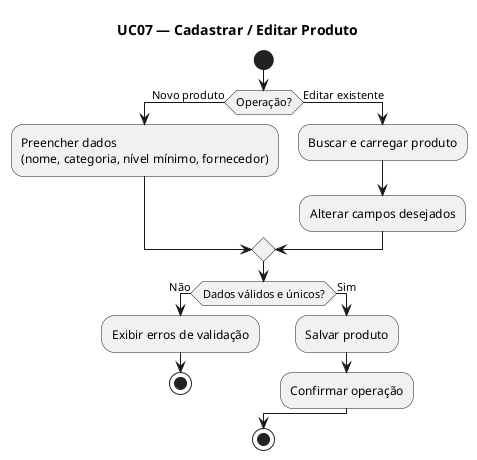

-------------------------------------

**UC08 — Gerenciar Contas a Pagar**  
*Ator:* Setor Administrativo  
*Descrição:* Permite ao setor administrativo visualizar, registrar, atualizar e quitar lançamentos em contas a pagar, incluindo os gerados automaticamente por compras de fornecedores.  
*Pré-condições:*  
•	Usuário autenticado com perfil administrativo.
•	Para quitação: lançamento deve existir com status 'Aberta' ou 'Atrasada'.  
*Pós-condições:*  
•	Lançamentos criados, atualizados ou quitados corretamente.  
•	Status atualizado: Aberta, Paga ou Atrasada.  
•	Histórico financeiro mantido com rastreabilidade completa.  
*Fluxo Principal*  
47.	Usuário acessa o módulo financeiro de contas a pagar.
48.	Sistema exibe a lista de lançamentos com status, valor, fornecedor e data de vencimento.  
49.	Usuário pode filtrar por status, fornecedor, período ou unidade.  
50.	Para quitar: usuário seleciona o lançamento e registra o pagamento com data e forma.  
51.	Sistema atualiza o status para 'Paga' e registra o histórico.  
52.	Sistema verifica lançamentos vencidos e atualiza automaticamente para 'Atrasada'.  
53.	Usuário pode exportar relatório de contas a pagar.  
*Fluxos Alternativos / Exceções*  
•	FA01 — Lançamento já quitado: sistema bloqueia nova quitação e exibe mensagem informativa.  
•	FA02 — Data de pagamento inválida (futura): sistema exibe alerta e solicita confirmação do usuário.  
•	FA03 — Lançamento não encontrado: sistema exibe mensagem e sugere ampliar os filtros de busca.  
*Relacionamentos*  
*Include:* Nenhum.  
*Extend:*   
•	UC05 — gerado indiretamente por UC04 que dispara tanto UC05 quanto UC08  

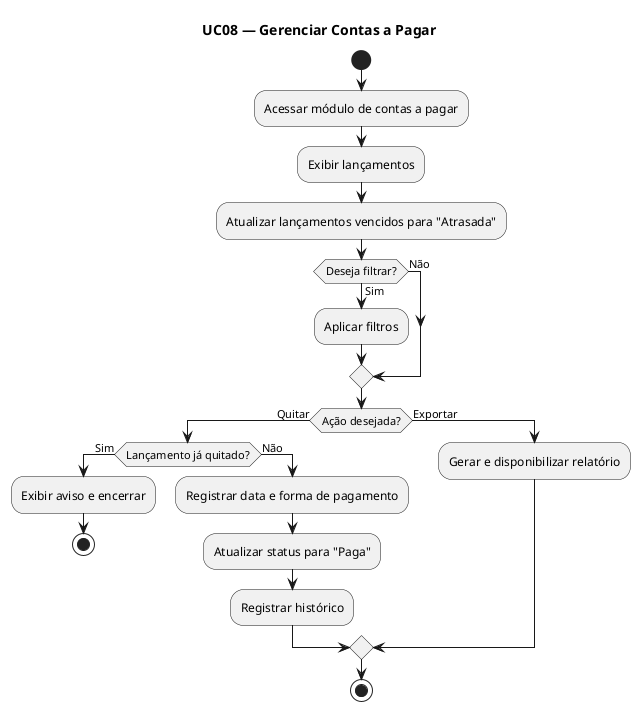

-------------------------------------

**UC09 — Emitir Alerta de Estoque Mínimo* * 
*Ator:* Sistema (ator secundário); notificação recebida por Gerente e Farmacêutico  
*Descrição:* O sistema monitora automaticamente os saldos de estoque e emite alertas sempre que um produto atingir ou ficar abaixo do nível mínimo cadastrado, orientando a necessidade de reposição.  
*Pré-condições:*  
•	Nível mínimo configurado para o produto (via UC07).  
•	UC05 executa o com novo saldo calculado.  
*Pós-condições:*  
•	Alerta registrado no sistema com produto, unidade, saldo atual e nível mínimo.  
•	Notificação enviada ao gerente responsável pela unidade.
•	Produto destacado na consulta de estoque (UC06)  .  
*Fluxo Principal*  
54.	UC05 finaliza a atualização do saldo de um produto.  
55.	Sistema compara o novo saldo com o nível mínimo cadastrado.  
56.	Se saldo <= nível mínimo, sistema gera um registro de alerta.  
57.	Sistema notifica o gerente da unidade sobre a necessidade de reposição.  
58.	Alerta é exibido no painel de indicadores e na tela de consulta de estoque.  
59.	Gerente pode, a partir do alerta, iniciar UC04 — Registrar compra de fornecedor.  
*Fluxos Alternativos / Exceções*  
•	FA01 — Nível mínimo não configurado: sistema ignora a verificação e registra log de configuração pendente.
•	FA02 — Alerta já existente e não resolvido: sistema atualiza o alerta existente sem duplicá-lo.  
*Relacionamentos*  
*Include:* Nenhum.  
*Extend:* Nenhum.  

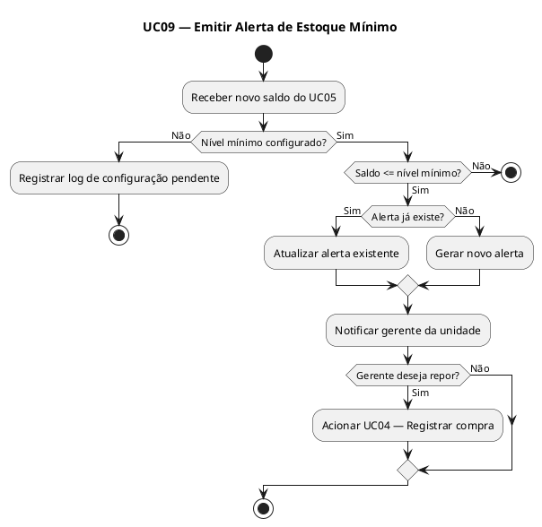

-------------------------------------

**UC10 — Visualizar Indicadores de Desempenho**  
*Atores:* Gerente, Setor Administrativo   
*Descrição:* Disponibiliza painéis e relatórios com indicadores   operacionais e financeiros da rede, como volume de vendas, produtos mais vendidos, posição de estoque e status financeiro por unidade.  
*Pré-condições:*  
•	Usuário autenticado com perfil de Gerente ou Setor Administrativo.  
•	Dados de vendas, estoque e financeiro disponíveis no sistema.    
*Pós-condições:*  
•	Indicadores exibidos conforme período e unidade selecionados.  
•	Relatórios disponíveis para exportação.  
*Fluxo Principal*  
60.	Usuário acessa o módulo de indicadores.
61.	Sistema exibe o painel padrão com indicadores do período atual.  
62.	Usuário seleciona o período de análise e a(s) unidade(s) desejada(s).  
63.	Sistema processa e exibe os indicadores: total de vendas, ticket médio, produtos críticos em estoque, contas em atraso, entre outros.  
64.	Usuário pode detalhar um indicador específico para análise mais   aprofundada.  
65.	Usuário pode exportar os dados em formato de relatório.  
*Fluxos Alternativos / Exceções*  
•	FA01 — Período sem dados: sistema informa que não há registros no intervalo selecionado.  
•	FA02 — Falha no processamento: sistema exibe mensagem de erro e registra log; usuário pode tentar novamente.  
*Relacionamentos*  
*Include:* Nenhum.  
*Extend:* Nenhum.  

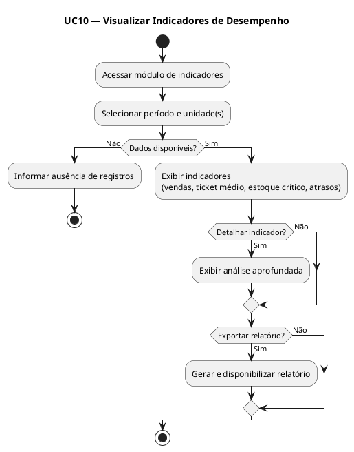

---

